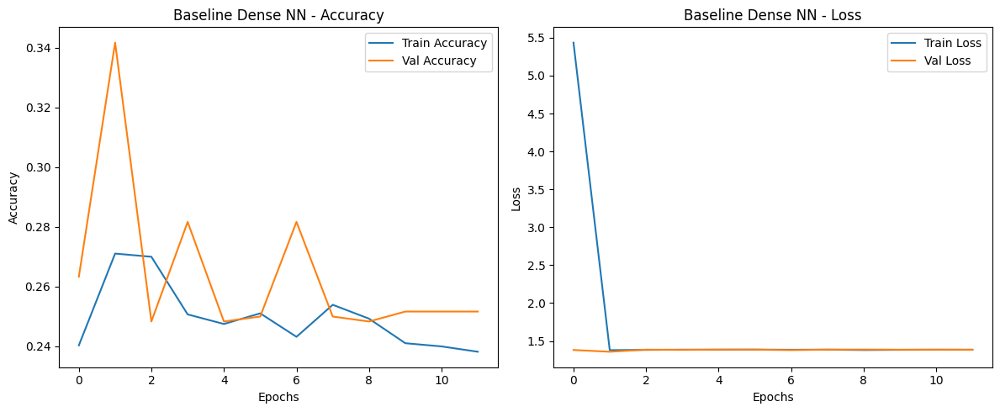
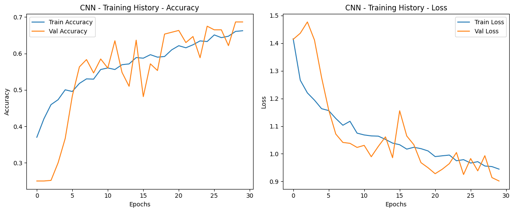
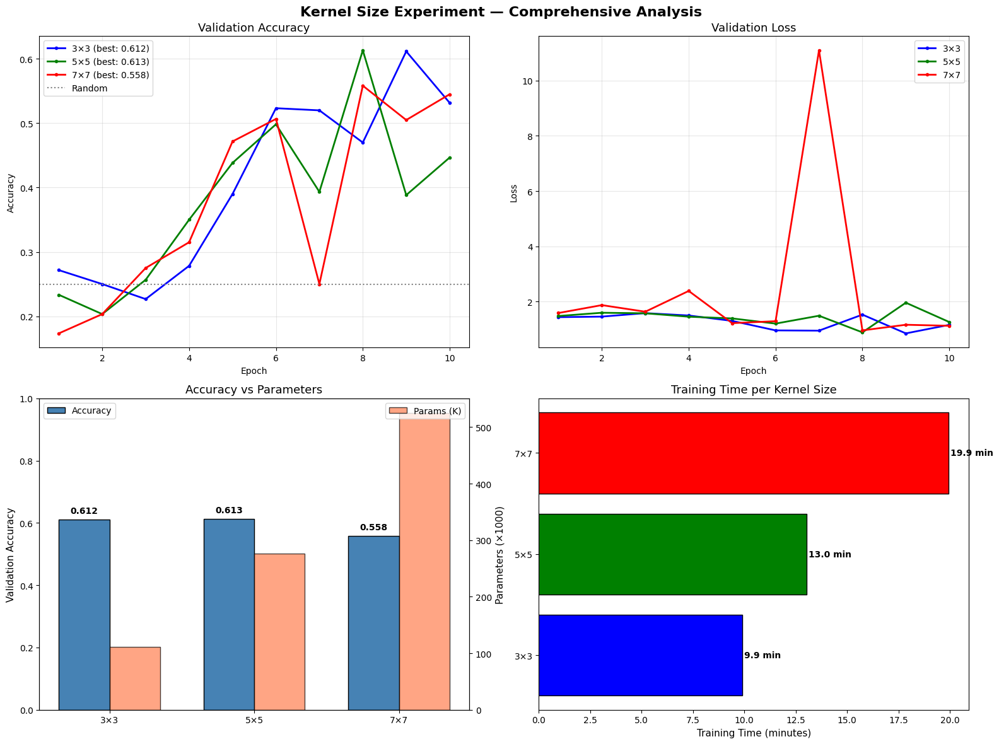
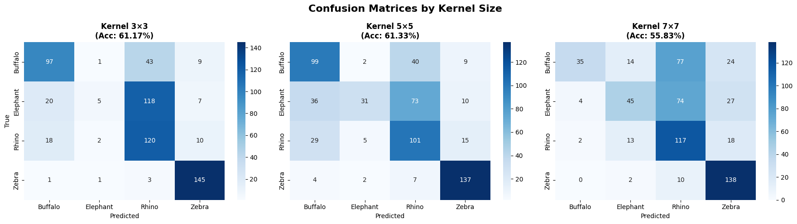

# Animal Classification with Convolutional Neural Networks

A deep learning project comparing fully-connected networks vs. convolutional neural networks (CNNs) for multi-class image classification of African wildlife. This project demonstrates how architectural choices critically impact model performance, achieving 2× better accuracy with 99% fewer parameters using CNNs.

## Getting Started

These instructions will help you set up and run the animal classification models on your local machine for development and experimentation.

### Prerequisites

To run this project, you need the following software installed:

- Python 3.x
- Jupyter Notebook
- NumPy
- Matplotlib
- tensorflow
- keras
- scikit-learn
- pandas

### Installing

Follow these steps to set up your development environment:

Step 1: Clone the repository

```bash
git clone https://github.com/mayerllyyo/cnn-inductive-bias-analysis
cd cnn-inductive-bias-analysis
```

Step 2: Create a virtual environment (recommended)

```bash
python -m venv venv
source venv/bin/activate
```

Step 3: Download the dataset

Download from Kaggle:
[Animal Computer Vision Clean Dataset & Code CNN-AI](https://www.kaggle.com/datasets/emirhanai/animal-computer-vision-clean-dataset-code-cnnai?resource=download)

## Built With

* [TensorFlow](https://www.tensorflow.org/) - Deep learning framework
* [Keras](https://keras.io/) - High-level neural networks API
* [NumPy](https://numpy.org/) - Numerical computing library
* [scikit-learn](https://scikit-learn.org/) - Machine learning utilities
* [Matplotlib](https://matplotlib.org/) - Visualization library
* [Pandas](https://pandas.pydata.org/) - Data manipulation and analysis

## Dataset

* Source: [Animal Computer Vision Clean Dataset](https://www.kaggle.com/datasets/emirhanai/animal-computer-vision-clean-dataset-code-cnnai)
* Author: Emirhan Bulut
* Size: 4,000 images (1,000 per class)
* Classes: Buffalo, Elephant, Rhino, Zebra
* License: Dataset available under Kaggle's terms of use

## Problem Description

This project tackles multi-class image classification of African wildlife. The challenge involves distinguishing between four visually distinct animal species based on complex visual patterns including texture, shape, size, and distinctive markings.

### Key Objectives:
1. Compare baseline fully-connected networks vs. CNNs
2. Analyze the impact of kernel size on model performance
3. Demonstrate parameter efficiency of convolutional architectures
4. Achieve high accuracy with limited training data

## Architecture Overview

### Baseline Model (Dense Network)
```
Input (128×128×3) → Flatten (49,152) 
→ Dense(256) → Dropout(0.5) 
→ Dense(128) → Dropout(0.3) 
→ Output(4)

Parameters: 12,616,580
```

### CNN Model (Optimized)
```
Input (128×128×3)
→ [Conv2D(32,3×3) + BN + ReLU + MaxPool] → (64×64×32)
→ [Conv2D(64,3×3) + BN + ReLU + MaxPool] → (32×32×64)
→ [Conv2D(128,3×3) + BN + ReLU + MaxPool] → (16×16×128)
→ GlobalAvgPool → Dense(128) + Dropout → Output(4)

Parameters: 111,172 (99.1% reduction)
```

## Experimental Results

### Model Performance Comparison

| Model | Accuracy | Parameters | Efficiency (Acc/Param) |
|-------|----------|------------|------------------------|
| Baseline (Dense) | 31.83% | 12,616,580 | 0.03 |
| CNN (3×3) | 67.83% | 111,172 | 6.18 |

Loss and accuracy curves showing CNN convergence vs. baseline overfitting



### Kernel Size Experiment

| Kernel Size | Val Accuracy | Parameters | Training Time |
|-------------|--------------|------------|---------------|
| 3×3 | 61.17% | 111,172 | 9.9 min |
| 5×5 | 61.33% | 276,548 | 13.0 min |
| 7×7 | 55.83% | 524,612 | 19.9 min |


### Per-Class Performance (Best Model)



| Class | Precision | Recall | F1-Score |
|-------|-----------|--------|----------|
| Buffalo | 0.74 | 0.70 | 0.72 |
| Elephant | 0.49 | 0.74 | 0.59 |
| Rhino | 0.59 | 0.39 | 0.47 |
| Zebra | 0.99 | 0.89 | 0.93 |

## Interpretation

### Key Findings

1. Architectural Superiority of CNNs
   - CNNs achieved 113% improvement over baseline (67.83% vs 31.83%)
   - 99% parameter reduction demonstrates extreme efficiency
   - Convolutional layers successfully learn spatial hierarchies

2. Kernel Size Trade-offs
   - Smaller kernels (3×3) are more parameter-efficient
   - Larger kernels (7×7) showed performance degradation
   - Optimal strategy: stack small kernels for deep feature learning

3. Class-Specific Insights
   - Zebra: Distinctive stripe patterns enable near-perfect classification
   - Rhino: Most challenging, often confused with Buffalo/Elephant
   - Elephant: High recall but lower precision (over-predicted)

4. Feature Learning Hierarchy
   - Layer 1: Detects edges and basic color gradients
   - Layer 2: Captures textures and local patterns
   - Layer 3: Identifies shapes and animal-specific parts

### Limitations

- Dataset size (4K images) limits model capacity
- Imbalanced error patterns suggest need for class-specific augmentation
- No transfer learning utilized (potential for further improvement)

## Author

- **Mayerlly Suárez Correa** [mayerllyyo](https://github.com/mayerllyyo)

## License

This project is licensed under the MIT License - see the [LICENSE](LICENSE) file for details